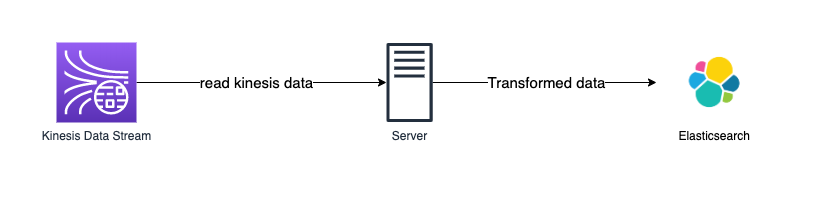

# kinesis-to-es

## 구조

---



### read_kinesis

1. kinesis shard 리스트 받기

    ```python
    client.describe_stream(
        StreamName=<kinesis stream name>,
        Limit=10 # 읽어올 샤드 데이터 수
    )
    ```

2. shard의 iterator를 받아온다 (iterator는 5분 후에 만료된다)

    ```python
    client.get_shard_iterator(
        StreamName=<kinesis stream name>,
        ShardId=<shard id>,
        ShardIteratorType='LATEST',
    		StartingSequenceNumber='string',
    		Timestamp=datetime(2015, 1, 1)
    )
    ```

    ShardIteratorType의 종류

    - AT_SEQUENCE_NUMBER - StartingSequenceNumber 값의 데이터 부터 읽는다.
    - AFTER_SEQUENCE_NUMBER - StartingSequenceNumber 값 이후의 데이터부터 읽는다.
    - TRIM_HORIZON - 가장 오래된 데이터부터 읽는다.
    - LATEST - 가장 최근의 데이터 부터 읽는다.
    - AT_TIMESTAMP - Timestamp에 입력된 시점의 데이터 부터 읽는다

3. shard의 데이터를 제한된 수만큼 읽어온다

    ```python
    client.get_records(
        ShardIterator=<shard iterator>,
        Limit=200  # 가져올 데이터 수 10000 보다 크면 에러 발생
    )
    ```

## 테스트

aws 설정

```python
# docker-compose.yml
environment:
  APP_ENV: dev
  AWS_ACCESS_KEY_ID: <aws access key>
  AWS_SECRET_ACCESS_KEY: <aws secret key>
```

Elasticsearch 설정

```python
# config.py
KINESIS_STREAM = "<kinesis stream name>"

# ES
ES_HOST = "<elasticsearch host>"
ES_HOST_PORT = <elasticsearch port>
ES_INDEX = "<es data prefix>"
ES_ERROR = "<es error data prefix>"
```

데이터 전송 테스트 실행

```python
docker-compose up
```